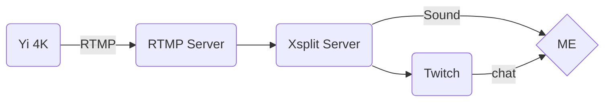

# Architecture

## Yi 4K

[Broadcast using QR Code](http://elproducente.com/how-to-live-stream-yi-4k-action-camera-tutorial/)

## RTMP Server

[NGINX-RTMP-Module](https://github.com/arut/nginx-rtmp-module)

[RTMP-UBUNTU](https://www.vultr.com/docs/setup-nginx-rtmp-on-ubuntu-14-04)

## Xsplit Server

use EC2 Windows Instance

## Twitch

:D

